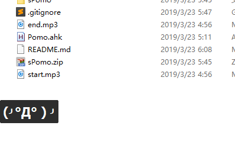

# sPomo, a small pomodoro for windows

> 用 AutoHotKey 制作的简单番茄钟. 由于在电脑前用手机当番茄钟实在是不方便, 桌面软件也很重, 不如快捷键来得爽, 所以有了它

## 说明

程序启动后, 随时连按这些键 `;;pom` 就能切换[工作模式](#工作模式)和[暂停模式](#暂停掀桌模式)

- 使用标准番茄钟, 每小时切割为 25min-5min-25min-5min
- 工作模式下, 会在`休息时间`和`番茄钟`之间无限轮换
- `暂停模式`就只有休息, 没有番茄
- 在窗口上使用鼠标右键退出软件
- 可通过替换`start.mp3`和`end.mp3`自定义开始&结束铃声, 现在只支持`mp3`
- [AHK](https://www.autohotkey.com/) 十分简单, 有兴趣自己看教程改也行

[下载 v0.1](https://github.com/Envl/sPomo/releases/download/v0.1/sPomo.zip)

> 编译的是 64 位版本, 32 位请自行编译

### 工作模式

- 番茄钟(25min)\
  
- 休息时间(5min)\
  

### 暂停(掀桌)模式

## 也许能让我继续更新它的方法

> 虽然这是个很简单的东西, 但对我而言太有用了, 所以如果也能对你有所帮助, 欢迎微信转个一毛钱, 为我人生第一桶金添砖加瓦, 也能让我 **万一** 有动力继续完善这个小番茄, 比如:

- 自定义快捷键
- 色彩主题
- 自定义时长
- UI 优化
- 背景白噪音

